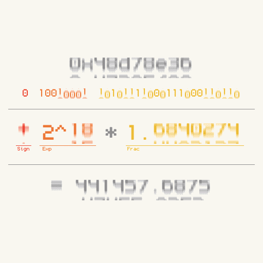

# Everyday One Motion - 20160225 "Floating Point Number"

JavaScript, Canvas

[Everyday One Motion](http://motions.work/motion/124)  
[Demo Page](http://fms-cat.github.io/eom_20160225/)  

## はじめに

**遅刻しました！！！** 本当にごめんなさい🙇🙇🙇🙇

## Floating Point Number

最後の技術回は、sin関数の仕組みや、サンプリング補完などの中から悩んでいましたが、浮動小数点について解説することにしました。  
IEEE754という規格で定められた、単精度浮動小数点について扱っています。いわゆる32bit floatです。  
普段我々が当たり前のようでコンピュータ上で扱っている小数も、内部では当然0と1で表現されています。  

## 浮動小数

浮動小数点数とは、その名の通り小数の位置を自在にグリグリ動かせる小数を言います。  
これにより、常に一定の相対誤差を保って、非常に大きな範囲の数(※1)を扱うことができます。  

他にもコンピュータ上で小数を表現するためには、固定小数点というものがあります。  
これは整数として表現した数字をある固定値（たとえば65536）で割っただけなので、浮動小数に比べて、表現できる値の範囲が非常に狭い(※2)です。  
その代わり、整数の計算と同様の処理で計算できるため、計算コストが少ないことが利点として挙げられます。  

※1: 1.4E-45 ~ 3.4E+38 @ 32bit  
※2: 1/65536 ~ 32767 @ 32bit

## 符号部、指数部、仮数部

浮動小数点のビットは、「符号部」「指数部」「仮数部」の3つにわけられます。  

符号部 は1ビットで構成され、数の符号（正負、+か-か）を表現します。  
指数部 は8ビットで構成され、小数点の位置を表現します。  
仮数部 は残りの23ビットで構成され、小数の位置を決める前の数の小数部分を表現します。  

…非常に説明が難しいです。  

`( -1 ^ 符号部 ) * ( 2 ^ ( 指数部 - 127 ) ) * ( 1.0 + 仮数部 )`  

## 例外

今回のgifでは扱っていませんが、浮動小数点は上の表現方法には当てはまらない、例外値がいくつか存在します。  

### 非正規化数

指数部が0となった時に、例外として `( 指数部 - 127 )` の箇所を `-126` とし、 `( 1.0 + 仮数部 )` の箇所を `( 0.0 + 仮数部 )`とします。  
これにより、0にとてつもなく近い数をもうひと段階表現することができます。  

### Infinity (無限), NaN (Not a Number)

指数部が255となったとき、

- 仮数部が0かつ符号部が0の場合、Infinity (無限大)
- 仮数部が0かつ符号部が1の場合、Infinity (無限小)
- 仮数部が0以外の場合、NaN (Not a Number)

を表現します。  
Inifinityは計算結果がとてつもなく大きくなってしまった場合に用いられ、NaNは0除算などの未定義数を表すのに使います。  
この辺りは環境やプログラミング言語によって挙動が違ったりするので注意が必要です。  

## 次回予告

3月は、[\[ Type \]](http://fms-cat.github.io/type) についての解説をしたいと思います。  
現時点では、ジオメトリ、ワードアート、ランダムUnicode文字…あたりを解説できれば良いと考えています。  
